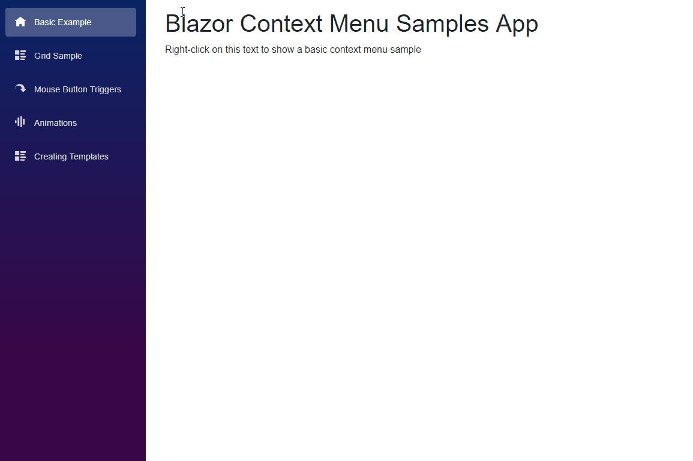

# Blazor Context Menu  

A context menu component for [Blazor](https://github.com/aspnet/Blazor) and [Razor Components](https://github.com/aspnet/AspNetCore/tree/master/src/Components) (aka server-side Blazor)!



> ⚠️ Warning

> This project is build on top of an experimental framework. There are many limitations and there is a high probability that there will be breaking changes from version to version.

## Demo
You can find a live demo [here](https://blazor-context-menu-demo.azurewebsites.net/).

## Installation
**1. Add the nuget package in your Blazor client project**
```
> dotnet add package Blazor.ContextMenu

OR

PM> Install-Package Blazor.ContextMenu
```
*Nuget package page can be found [here](https://www.nuget.org/packages/Blazor.ContextMenu).*

**2. Add the following line in your Blazor client project's startup class**

```csharp
public class Startup
{
    public void ConfigureServices(IServiceCollection services)
    {
        services.AddBlazorContextMenu();
    }
}
```
**3. Add the following lines in your `_ViewImports.cshtml`**
```csharp
@using BlazorContextMenu
@addTagHelper *, BlazorContextMenu
```

### Sample usage

```xml

<ContextMenu Id="myMenu">
    <Item Click="@OnClick">Item 1</Item>
    <Item Click="@OnClick">Item 2</Item>
    <Item Click="@OnClick" Enabled="false">Item 3 (disabled)</Item>
    <Seperator />
    <Item>Submenu
        <SubMenu>
            <Item Click="@OnClick">Submenu Item 1</Item>
            <Item Click="@OnClick">Submenu Item 2</Item>
        </SubMenu>
    </Item>
</ContextMenu>

<ContextMenuTrigger MenuId="myMenu">
    <p>Right-click on me to show the context menu !!</p>
</ContextMenuTrigger>

@functions{
    void OnClick(MenuItemClickEventArgs e)
    {
        Console.WriteLine($"Item Clicked => Menu: {e.ContextMenuId}, MenuTarget: {e.ContextMenuTargetId}, IsCanceled: {e.IsCanceled}, MenuItem: {e.MenuItemElement}, MouseEvent: {e.MouseEvent}");
    }
}

```

### Customization

#### Templates

You can create templates in the configuration that you can then apply to context menus. 

```csharp
public class Startup
{
    public void ConfigureServices(IServiceCollection services)
    {
        services.AddBlazorContextMenu(options =>
        {
            options.ConfigureTemplate("myTemplate", template =>
            {
                template.MenuCssClass = "my-menu";
                template.MenuItemCssClass = "my-menu-item";
                //...
            });
        });
    }
}
```
```xml
<style>
    .my-menu { color: darkblue; }
    
    /* using css specificity to override default background-color */
    .my-menu .my-menu-item { background-color: #ffb3b3;}
    .my-menu .my-menu-item:hover { background-color: #c11515;} 
</style>

<ContextMenu Id="myMenu" Template="myTemplate">
    <Item>Item 1</Item>
    <Item>Item 2</Item>
</ContextMenu>
```

You can also change the default template that will apply to all context menus (unless specified otherwise). 

```csharp
public class Startup
{
    public void ConfigureServices(IServiceCollection services)
    {
        services.AddBlazorContextMenu(options =>
        {
            //Configures the default template
            options.ConfigureTemplate(defaultTemplate =>
            {
                defaultTemplate.MenuCssClass = "my-default-menu";
                defaultTemplate.MenuItemCssClass = "my-default-menu-item";
                //...
            });

            options.ConfigureTemplate("myTemplate", template =>
            {
                template.MenuCssClass = "my-menu";
                template.MenuItemCssClass = "my-menu-item";
                //...
            });
        });
    }
}
```
#### Explicit customization
All components expose `CssClass` parameters that you can use to add css classes. These take precedence over any template configuration.

```xml
<ContextMenu Id="myMenu" CssClass="my-menu">
    <Item CssClass="red-menuitem">Red looking Item</Item>
    <Item>Default looking item</Item>
</ContextMenu>
```

### Overriding default css

You can override the default css classes completely in the following ways (not recommended unless  you want to achieve advanced customization).

#### Override default css using templates

```csharp
public class Startup
{
    public void ConfigureServices(IServiceCollection services)
    {
        services.AddBlazorContextMenu(options =>
        {
            //This will override the default css classes for the default tenplate
            options.ConfigureTemplate(defaultTemplate =>
            {
                defaultTemplate.DefaultCssOverrides.MenuCssClass  = "custom-menu";
                defaultTemplate.DefaultCssOverrides.MenuItemCssClass= "custom-menu-item";
                defaultTemplate.DefaultCssOverrides.MenuItemDisabledCssClass = "custom-menu-item--disabled";
                //...
            });
        });
    }
}
```

#### Using the `OverrideDefaultXXX` parameters on components. These take precedence over the template overrides.

```xml
<ContextMenu Id="myMenu" OverrideDefaultCssClass="custom-menu">
    <Item OverrideDefaultCssClass="custom-menu-item" OverrideDefaultDisabledCssClass="custom-menu-item--disabled">Item 1</Item>
    <Item OverrideDefaultCssClass="custom-menu-item" OverrideDefaultDisabledCssClass="custom-menu-item--disabled">Item 2</Item>
</ContextMenu>
```


## ⚠️ Breaking changes ⚠️
Upgrading from 0.10 to 0.11
>- The `CssOverrides` API is removed and override configuration is moved into templates. The `DefaultCssOverrides` of the `ConfigureTemplate` API must be used.


Upgrating from 0.5 to 0.6
>- You must add in `Startup.ConfigureServices` of your Blazor client side project the following line `services.AddBlazorContextMenu();`
>- The `BlazorContextMenu.BlazorContextMenuDefaults` API is removed. Use the API provided in the service configuration.

Upgrating from 0.1 to 0.2
>- Rename "MenuItem" to "Item"
>- Rename "MenuSeperator" to "Seperator"
>- Replace "MenuItemWithSubmenu" with a regular "Item" component

## Release Notes
### 0.11-beta
>- Updated to Blazor 0.8.0
>- Added animations
>- Default css overrides are now part of the `Templates` API so that you can easily have multiple custom overriden menus
>- Razor Components are not loading the static files included in the library => [#6349](https://github.com/aspnet/AspNetCore/issues/6349). As a workaround you can download and reference directly the **.css** and **.js** from the `/BlazorContextMenu/content` folder until the issue is resolved.

### 0.10
>- Added proper support for Razor Components (aka server-side Blazor)

### 0.9
>- Updated to Blazor 0.7.0
>- Removed some js interop in favor of the new Cascading Values feature

### 0.8
>- Updated to Blazor 0.6.0

### 0.7
>- Added left-click trigger support

### 0.6
>- Updated to Blazor 0.5.1
>- Changed configuration setup
>- Added templates

### 0.5
>- Updated to Blazor 0.5.0

### 0.4
>- Added minification for included css/js
>- Updated to Blazor 0.4.0

### 0.3
>- Added dynamic EnabledHandlers for menu items
>- Added Active and dynamic ActiveHandlers for menu items

### 0.2
>- Updated to Blazor 0.3.0
>- Renamed "MenuItem" to "Item" to avoid conflicts with the html element "menuitem"
>- Renamed "MenuSeperator" to "Seperator" for consistency
>- Removed "MenuItemWithSubmenu" (just use a regular "Item")

### 0.1
>- Initial release

## Special Thanks

This project is inspired by https://github.com/fkhadra/react-contexify and https://github.com/vkbansal/react-contextmenu
