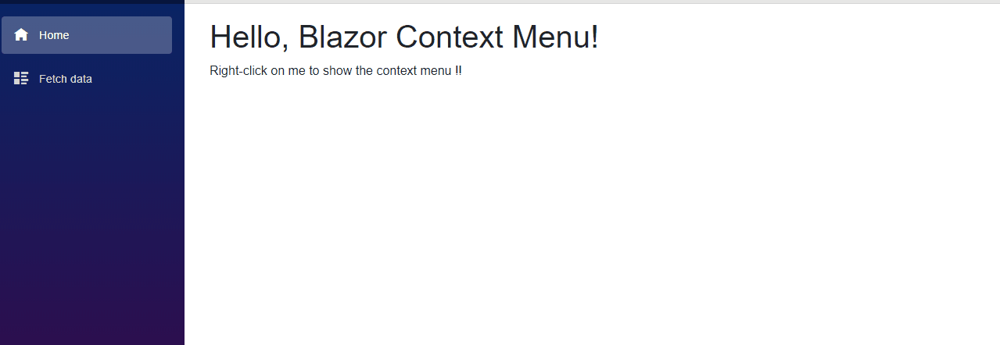

# Blazor Context Menu  

A context menu component for [Blazor](https://github.com/aspnet/Blazor) !



> ⚠️ Warning: This project is build on top of an experimental framework. There are many limitations and there is a high propability that there will be breaking changes from version to version.

## Demo
You can find a live demo [here](https://blazor-context-menu-demo.azurewebsites.net/).

## Installation

```
> dotnet add package Blazor.ContextMenu

OR

PM> Install-Package Blazor.ContextMenu
```
Nuget package page can be found [here](https://www.nuget.org/packages/Blazor.ContextMenu).

## Usage

### Basic usage

```xml
@addTagHelper *, BlazorContextMenu

<ContextMenu Id="myMenu">
    <Item Click="@OnClick">Item 1</Item>
    <Item Click="@OnClick">Item 2</Item>
    <Item Click="@OnClick" Enabled="false">Item 3 (disabled)</Item>
    <Seperator />
    <Item>Submenu
        <SubMenu>
            <Item Click="@OnClick">Submenu Item 1</Item>
            <Item Click="@OnClick">Submenu Item 2</Item>
        </SubMenu>
    </Item>
</ContextMenu>

<ContextMenuTrigger MenuId="myMenu">
    <p>Right-click on me to show the context menu !!</p>
</ContextMenuTrigger>

@functions{
    void OnClick(MenuItemClickEventArgs e)
    {
        Console.WriteLine($"Item Clicked => Menu: {e.ContextMenuId}, MenuTarget: {e.ContextMenuTargetId}, IsCanceled: {e.IsCanceled}, Item: {e.ItemElement}, MouseEvent: {e.MouseEvent}");
    }
}

```

## ⚠️ Breaking changes ⚠️
Upgrating from 0.1 to 0.2
>- Rename "MenuItem" to "Item"
>- Rename "MenuSeperator" to "Seperator"
>- Replace "MenuItemWithSubmenu" with a regular "Item" component


## Release Notes

### 0.2
>- Moved to blazor 0.3.0
>- Renamed "MenuItem" to "Item" to avoid conflicts with the html element "menuitem"
>- Renamed "MenuSeperator" to "Seperator" for consistency
>- Removed "MenuItemWithSubmenu" (just use a regular "Item")

### 0.1
>- Initial release

## Special Thanks

This project is inspired by https://github.com/fkhadra/react-contexify and https://github.com/vkbansal/react-contextmenu
